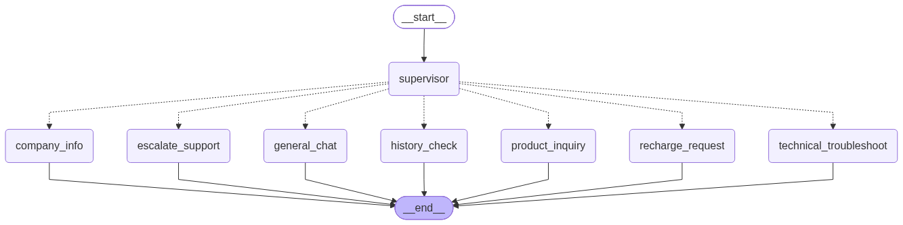

# 📡 DishBot – Enterprise Agentic Support System for DishTV

DishBot is an enterprise-grade, router-based conversational AI system built using **LangGraph**, **FastAPI**, **MongoDB**, and **Pydantic V2**. It follows a **Supervisor-Worker (Hub-and-Spoke)** architecture, handles multi-turn conversational memory, executes dynamic database lookups without hardcoded data, powers a Corrective RAG (CRAG) pipeline with cross-encoder reranking, and enforces strict **Human-in-the-Loop (HITL)** controls for financial recharge transactions.

---

## 🏗️ System Architecture Flow

### 1. Compiled LangGraph State Machine


### 2. End-to-End Execution Flow (Data & Actions)
```mermaid
flowchart TD
    User([User Request]) --> API[FastAPI /chat Endpoint]
    API --> Memory[LangGraph Checkpointer / Thread Memory]
    Memory --> Supervisor[Supervisor Router Node\n- Chain-of-Thought Intent Classifier]

    Supervisor -->|product_inquiry| ProdAgent[Product Knowledge Node\n- Autonomous ReAct Agent\n- Live MongoDB Catalog Tools]
    Supervisor -->|company_info| RAGPipeline[TechChefz RAG Node\n- Query Transformation\n- Vector Search Top-8\n- FlashRank Cross-Encoder Reranker\n- Corrective Confidence Gate]
    Supervisor -->|recharge_request| RechargeNode[Recharge Action Node\n- Dynamic MongoDB Price Resolution\n- Pydantic Slot-Filling\n- Human-in-the-Loop Approval]
    Supervisor -->|history_check| HistoryNode[History Node\n- Live MongoDB User History Query]
    Supervisor -->|technical_troubleshoot| TroubleshootNode[Troubleshooting Node (Bonus)\n- Step-by-Step Hardware Diagnostics]
    Supervisor -->|escalate_support| EscalateNode[Escalation Node\n- Ticket Generation #XYZ\n- Sentiment & Repeat Tracker]
    Supervisor -->|general_chat| ChatNode[General Chat Node]

    RechargeNode -->|Awaiting Approval| Pause([Prompt User: Yes/No])
    RechargeNode -->|Approved| Exec[Execute Payment & Log to MongoDB]

    ProdAgent --> Format[Format Response + Official Web Citation]
    RAGPipeline --> Format
    HistoryNode --> Format
    TroubleshootNode --> Format
    EscalateNode --> Format
    ChatNode --> Format
    Exec --> Format

    Format --> Log[Log Interaction to MongoDB chats_collection]
    Log --> End([Return JSON Response to Client])
```

---

## 📂 Codebase Structure & File-by-File Breakdown

```text
assignment2/
├── .env                                  # Local environment configuration
├── .example.env                          # Template for environment variables
├── pyproject.toml                        # Project dependencies and packaging
├── README.md                             # Architecture & project documentation
├── TechChefz Digital __ Chatbot Content.docx.pdf # RAG knowledge base document
├── scripts/
│   └── seed_data.py                      # Data ingestion & vector store creation
└── app/
    ├── __init__.py
    ├── main.py                           # FastAPI application entry point
    ├── graph.py                          # LangGraph StateGraph & workflow wiring
    ├── core/
    │   ├── __init__.py
    │   ├── config.py                     # Pydantic BaseSettings configuration
    │   └── llm.py                        # Centralized LLM factory (retries, timeouts)
    ├── database/
    │   ├── __init__.py
    │   ├── connection.py                 # MongoDB Async client & collections
    │   ├── dishtv_data.json              # Scraped DishTV products & packs
    │   └── chroma_db/                    # Local persistent Chroma vector store
    ├── models/
    │   ├── __init__.py                   # Model exports
    │   └── model.py                      # Pydantic schemas (State, Router, HITL)
    ├── tools/
    │   ├── __init__.py
    │   ├── product_tools.py              # Dynamic MongoDB product search tools
    │   └── recharge_tools.py             # Dynamic MongoDB package lookup tools
    └── nodes/
        ├── __init__.py
        ├── supervisor.py                 # Intent routing brain
        ├── product_knowledge.py          # Product ReAct lookup worker
        ├── techchefz_rag.py              # Corrective RAG worker
        ├── recharge.py                   # Pydantic recharge slot-filling & HITL worker
        ├── history.py                    # Past transaction lookup worker
        ├── troubleshooting.py            # Hardware & error diagnostics worker (Bonus)
        ├── escalation.py                 # Human agent handover worker
        └── general_chat.py               # Conversational pleasantries worker
```

### Detailed File Functions

#### 1. Core & Infrastructure Layer
* **`app/core/config.py`**: Uses `pydantic-settings` to safely validate environment variables (`MONGODB_URI`, `GEMINI_API_KEY`, `OPENROUTER_API_KEY`, `LANGCHAIN_*`).
* **`app/core/llm.py`**: Centralized factory function `get_llm(temperature)` that configures model providers with automatic retries and standard timeouts.
* **`app/database/connection.py`**: Exports the asynchronous MongoDB database client and collections:
  * `products_collection`: Hardware set-top boxes, smart TV keys, and recharge packages.
  * `recharge_history_collection`: Financial transaction audit records.
  * `chats_collection`: Persistent logging for all user interactions and bot responses.

#### 2. Models & State Management
* **`app/models/model.py`**:
  * `AgentState`: Central LangGraph state containing conversation history (`messages` with `add_messages`), `user_id`, `conversation_id`, slot tracker `recharge_slots`, and `awaiting_recharge_confirmation`.
  * `RouteDecision`: Structured output schema used by the Supervisor to enforce strict routing classification.
  * `RechargeSlots`: Pydantic V2 model for validating recharge amount, package name, and confirmation flags.
  * `ChatRequest` & `ChatResponse`: Request and response schemas matching the assignment specifications.

#### 3. Database Tools Layer (No Hardcoding)
* **`app/tools/product_tools.py`**: Contains `search_product` and `list_all_products` LangChain tools that query MongoDB dynamically using regex and category filters.
* **`app/tools/recharge_tools.py`**: Contains `get_all_recharge_packages` and `lookup_package_and_price` to dynamically fetch active packs and extract their rupee rates directly from MongoDB.

#### 4. Specialized Worker Nodes
* **`app/nodes/supervisor.py`**: Analyzes conversation history and latest user query using Chain-of-Thought reasoning to route traffic to the appropriate specialist.
* **`app/nodes/product_knowledge.py`**: Autonomous ReAct agent built with `create_react_agent` that uses live MongoDB tools to answer product/pack questions and attaches official `source_url` citations.
* **`app/nodes/techchefz_rag.py`**: Advanced RAG pipeline implementing:
  1. Multi-turn query transformation (condensing vague follow-ups).
  2. Dense vector retrieval (top-8 chunks).
  3. FlashRank cross-encoder reranking (selecting top-3 most relevant passages).
  4. Confidence/relevance grading gate to prevent hallucinating on out-of-domain questions.
* **`app/nodes/recharge.py`**: Financial action node that extracts recharge parameters, auto-resolves live package prices from MongoDB, and strictly halts for **Human-in-the-Loop approval** before creating a transaction in `recharge_history_collection`.
* **`app/nodes/history.py`**: Queries MongoDB for the current `user_id` and summarizes the last 5 transactions.
* **`app/nodes/troubleshooting.py` (Bonus Deliverable)**: Guides users through step-by-step hardware and signal diagnostics (Error 101/102, Error 301/Rain Fade, black screen, remote pairing).
* **`app/nodes/escalation.py`**: Creates a support ticket (`#XYZ`) and hands the conversation over to a live human agent if requested or if negative sentiment is detected.
* **`app/nodes/general_chat.py`**: Handles greetings, general DishTV questions, and conversational pleasantries.

#### 5. Graph Wiring & API Layer
* **`app/graph.py`**: Assembles the LangGraph `StateGraph`, registers all 7 nodes, configures conditional routing edges, and attaches `MemorySaver` checkpointer for session persistence.
* **`app/main.py`**: Exposes the `POST /chat` REST endpoint, executes the graph with session threads (`thread_id=conversation_id`), logs conversations to MongoDB, and exports LangSmith traces.
* **`scripts/seed_data.py`**: Seeds `app/database/dishtv_data.json` into MongoDB and chunks/embeds `TechChefz Digital __ Chatbot Content.docx.pdf` into local ChromaDB.

---

## 🚀 Setup & Installation Guide

### Prerequisites
* **Python 3.12+**
* **`uv`** package manager (recommended) or standard `pip`
* **MongoDB** (Local instance running at `mongodb://localhost:27017` or MongoDB Atlas URI)

### 1. Clone & Install Dependencies
```bash
git clone <your-repo-url>
cd assignment2

# Install dependencies using uv
uv sync
```

### 2. Configure Environment Variables
Create a `.env` file in the root directory (based on `.example.env`):
```env
# LLM Providers (Google Gemini or OpenRouter)
GEMINI_API_KEY=your_gemini_api_key_here
OPENROUTER_API_KEY=your_openrouter_api_key_here

# MongoDB Configuration
MONGODB_URI=mongodb://localhost:27017
MONGODB_DB_NAME=dishbot_db

# Observability (LangSmith Tracing)
LANGCHAIN_TRACING_V2=true
LANGCHAIN_API_KEY=your_langsmith_api_key_here
LANGCHAIN_PROJECT=dishbot-agent
```

### 3. Seed Database & Ingest Knowledge Base
Run the seeding script to populate MongoDB collections and initialize ChromaDB:
```bash
uv run python -m scripts.seed_data
```
*Expected Output:*
```text
 [1/3] Seeded 13 DishTV products & packages into MongoDB.
 [2/3] Seeded 3 dummy recharge records for 'user_123'.
 Reading TechChefz Digital PDF content...
 [3/3] Ingested 56 chunks into ChromaDB at 'app\database\chroma_db'.
 All Data Ingestion Complete!
```

### 4. Start the Application
Run the FastAPI development server:
```bash
uv run uvicorn app.main:app --reload --port 8000
```
The REST API will be live at:
* Swagger UI Docs: **`http://localhost:8000/docs`**
* Health Check: **`http://localhost:8000/health`**

---

## 🧪 Testing & Verification Scenarios

You can test all user journeys directly through Swagger UI or via `curl`:

### Scenario 1: Product Inquiry & Multi-Turn Memory
```bash
# Turn 1: Initial Question
curl -X POST "http://localhost:8000/chat" \
  -H "Content-Type: application/json" \
  -d '{"message": "Tell me about Dish SMRT Hub", "user_id": "user_123", "conversation_id": "session_1"}'

# Turn 2: Follow-up using Pronoun ("it")
curl -X POST "http://localhost:8000/chat" \
  -H "Content-Type: application/json" \
  -d '{"message": "How much does it cost?", "user_id": "user_123", "conversation_id": "session_1"}'
```
*Behavior:* Bot identifies that *"it"* refers to Dish SMRT Hub, retrieves ₹1,699 pricing from MongoDB, and includes the official weblink.

---

### Scenario 2: Dynamic Catalog Package Browsing
```bash
curl -X POST "http://localhost:8000/chat" \
  -H "Content-Type: application/json" \
  -d '{"message": "What recharge packages are available?", "user_id": "user_123", "conversation_id": "session_2"}'
```
*Behavior:* Routes to `product_inquiry`, queries MongoDB `products_collection`, and lists active packs (*Super Family, Flexi HD, Swagat Combo, Value Saver*) with live prices.

---

### Scenario 3: Recharge Action with Human-in-the-Loop (HITL)
```bash
# Step 1: Request recharge with package
curl -X POST "http://localhost:8000/chat" \
  -H "Content-Type: application/json" \
  -d '{"message": "I want to recharge Super Family", "user_id": "user_123", "conversation_id": "session_3"}'
# Response: "You are about to recharge for ₹249 on Super Family (Flexi Pack 249). Do you approve? (Yes/No)"

# Step 2: Confirm Transaction
curl -X POST "http://localhost:8000/chat" \
  -H "Content-Type: application/json" \
  -d '{"message": "Yes", "user_id": "user_123", "conversation_id": "session_3"}'
# Response: Confirms execution with unique Transaction ID #TXN... and logs to MongoDB.
```

---

### Scenario 4: User Transaction History
```bash
curl -X POST "http://localhost:8000/chat" \
  -H "Content-Type: application/json" \
  -d '{"message": "Show my transaction history", "user_id": "user_123", "conversation_id": "session_3"}'
```
*Behavior:* Queries `recharge_history_collection` and formats the last 5 transactions in reverse chronological order.

---

### Scenario 5: TechChefz RAG with FlashRank Reranking
```bash
curl -X POST "http://localhost:8000/chat" \
  -H "Content-Type: application/json" \
  -d '{"message": "What services does TechChefz offer?", "user_id": "user_123", "conversation_id": "session_4"}'
```
*Behavior:* Transforms query, retrieves 8 candidates, reranks to top-3 via FlashRank cross-encoder, verifies relevance score, and synthesizes a grounded answer with source link.

---

### Scenario 6: Technical Troubleshooting (Bonus Feature)
```bash
curl -X POST "http://localhost:8000/chat" \
  -H "Content-Type: application/json" \
  -d '{"message": "My TV shows Error 101, what should I do?", "user_id": "user_123", "conversation_id": "session_5"}'
```
*Behavior:* Guides the user through a structured 5-step diagnostic process to clean and reseat the Viewing Card.

---

### Scenario 7: Support Escalation
```bash
curl -X POST "http://localhost:8000/chat" \
  -H "Content-Type: application/json" \
  -d '{"message": "Talk to human", "user_id": "user_123", "conversation_id": "session_6"}'
```
*Behavior:* Returns standard ticket creation message: *"I am connecting you with a live agent. Your ticket ID is #XYZ."*

---

## 🔍 Observability (LangSmith Tracing)

Every step of the agent execution pipeline is traced through **LangSmith**:
* Intent classification routing decisions.
* ReAct tool calls (`search_product`, `lookup_package_and_price`).
* RAG dense retrieval and FlashRank reranking scores.
* Human-in-the-Loop state pauses and resume transitions.

To view traces, log into your [LangSmith Dashboard](https://smith.langchain.com/) under the project `dishbot-agent`.
